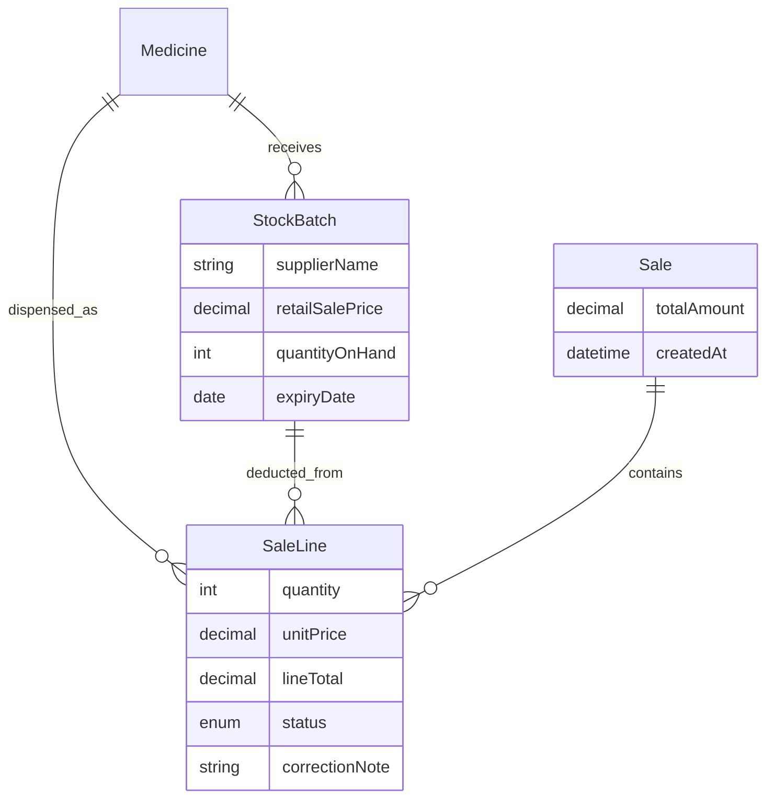

# AfyaSmart-Stock — Complete Project Documentation

**Last updated:** May 2026  
**Status:** MVP operational (local PostgreSQL)

---

## Table of contents

1. [What we built](#1-what-we-built)
2. [Repository layout](#2-repository-layout)
3. [KEML reference data](#3-keml-reference-data)
4. [Application stack](#4-application-stack)
5. [Database schema](#5-database-schema)
6. [Routes & user journeys](#6-routes--user-journeys)
7. [Server actions API](#7-server-actions-api)
8. [UI & UX](#8-ui--ux)
9. [Seeding & sample data](#9-seeding--sample-data)
10. [Build history (phases)](#10-build-history-phases)
11. [Operations guide](#11-operations-guide)
12. [Known gaps & future work](#12-known-gaps--future-work)
13. [Related documents](#13-related-documents)

---

## 1. What we built

**AfyaSmart-Stock** is a pharmacy **point-of-sale and stock** MVP for Kenyan facilities. It uses **KEML 2023** as a **catalog autocomplete** layer (drug name + formulation)—not as operational inventory.

| Capability | Summary |
|------------|---------|
| **KEML catalog** | ~1,567 medicines seeded; ~1,459 searchable in POS/receive |
| **Brand alias search** | ~3,654 aliases (`alias_names.json`); type Panadol, Septrin, Coartem, etc. |
| **Receive stock** | Search catalog → record batch, qty, expiry, supplier, costs, retail price |
| **FEFO dispense** | POS cart → transactional deduct (nearest expiry first) + sale log |
| **Pricing** | Unit price from batch retail price; receipt shows line totals + grand total |
| **Sales tracking** | Today’s revenue, units, top drugs (today + 7 days) |
| **Audit corrections** | Edit or void dispensed lines; stock restored/adjusted; reason required |
| **Operations dashboard** | Expiry alerts (90d), low stock, FEFO-ordered active batches |
| **Telemetry** | Sentry (client, server, edge) on all server actions |

```mermaid
flowchart LR
  KEML[KEML JSON/CSV] --> Medicine[(Medicine catalog)]
  Receive[/receive] --> StockBatch[(StockBatch)]
  POS[/pos] --> Sale[(Sale + SaleLine)]
  StockBatch --> POS
  Medicine --> Receive
  Medicine --> POS
  Sale --> Sales[/sales dashboard]
```

---

## 2. Repository layout

**Git root and Vercel root:** this folder (`afyasmart-app/`). A parent `README.md` may exist if the repo is checked out one level higher.

```
afyasmart-app/                 ← project root (deploy from here)
├── DOCUMENTATION.md           ← This file
├── ARCHITECTURE.md
├── ACHIEVEMENTS.md
├── .cursorrules
├── vercel.json
├── data/
│   ├── final_keml_2023.json   ← KEML catalog seed (1,576 rows)
│   ├── final_keml_2023.csv
│   ├── alias_names.json       ← Brand aliases seed
│   ├── clean_index_names.json
│   └── clean_index_names_with_pages.json
├── prisma/
│   ├── schema.prisma
│   ├── seed.ts
│   ├── seed-stock.ts
│   └── seed-aliases.ts
├── src/
│   ├── app/                   ← /, /receive, /pos, /sales
│   ├── components/
│   ├── lib/actions/
│   └── generated/prisma/
├── FRONTEND.md
└── README.md
```

---

## 3. KEML reference data

### Production files (kept)

| File | Records | Used by app |
|------|---------|-------------|
| `data/final_keml_2023.json` | 1,576 | `npm run db:seed` |
| `data/final_keml_2023.csv` | 1,576 | Backup / Excel |
| `data/alias_names.json` | 695 | `npm run db:seed-aliases` |
| `data/clean_index_names.json` | 694 | Legacy index (not seeded) |
| `data/clean_index_names_with_pages.json` | 694 | PDF cross-ref only |

### Row fields (catalog)

`generic_name`, `dosage_form`, `strength`, `level_of_use`, `chapter`, `section`, `subsection`, `code`, `page`

### Stubs (hidden from search)

- `dosage_form` = `As per KEML listing`
- `strength` = `As per clinical need`

Marked `isStub: true` in DB (~108 rows).

### Design decision

KEML seeds **what can be dispensed** (product definitions). **Stock, supplier, and pricing** live only in `StockBatch` created via **Receive** or `db:seed-stock`.

---

## 4. Application stack

| Layer | Technology |
|-------|------------|
| Framework | Next.js 14 (App Router, `src/`) |
| Language | TypeScript (strict) |
| UI | Tailwind CSS, Shadcn UI, Lucide icons, Sonner toasts |
| Layout | `AppShell` — fixed sidebar navigation |
| Client state | Zustand (`cart-store` on POS only) |
| ORM | Prisma 7 + `@prisma/adapter-pg` + `pg` |
| Database | PostgreSQL (local) |
| Observability | `@sentry/nextjs` + `runAction()` wrapper |

### Environment (`.env` / `.env.local`)

| Variable | Purpose |
|----------|---------|
| `DATABASE_URL` | PostgreSQL connection |
| `SENTRY_DSN` | Server Sentry |
| `NEXT_PUBLIC_SENTRY_DSN` | Browser Sentry |
| `NEXT_PUBLIC_FACILITY_NAME` | Thermal receipt header |
| `SENTRY_ORG` / `SENTRY_PROJECT` | Optional (source maps) |

Prisma loads `.env.local` first, then `.env` (`prisma.config.ts`).

### NPM scripts

| Command | Purpose |
|---------|---------|
| `npm run dev` | Dev server → http://localhost:3000 |
| `npm run build` | Production build (verified) |
| `npx prisma db push` | Sync schema |
| `npm run db:seed` | Import KEML medicines |
| `npm run db:seed-stock` | Sample stock for ~95 common drugs |
| `npm run db:generate` | Regenerate Prisma client |
| `npx prisma studio` | DB browser |

---

## 5. Database schema

### Models

**Medicine** — KEML formulary row (`searchKey` unique, `isStub` flag).

**MedicineAlias** — Kenyan market brand / trade name linked to a formulation (`@@unique([medicineId, name])`, indexed on `name`).

**StockBatch** — Operational lot:

- `batchNumber`, `supplierName`
- `quantityOnHand`, `expiryDate`
- `supplierCost`, `retailSalePrice` (Decimal)
- `receivedAt`

**Sale** — Dispense header:

- `createdAt`, `totalAmount` (sum of active lines)

**SaleLine** — Line item:

- `quantity`, `unitPrice`, `lineTotal`
- `status`: `ACTIVE` | `VOIDED`
- `correctionNote` (audit trail)
- Snapshots: `genericName`, `dosageForm`, `strength`
- FKs: `medicineId`, `stockBatchId`, `saleId`



### Seed counts (typical)

| Dataset | Count |
|---------|------:|
| Medicines (total) | 1,567 |
| Searchable (non-stub) | 1,459 |
| Stock batches (`db:seed-stock`) | ~219 on ~95 drugs |

---

## 6. Routes & user journeys

| Route | Who | Flow |
|-------|-----|------|
| **`/`** | Pharmacist / manager | KPI expiry + low stock; FEFO active stock table; links to receive/POS |
| **`/receive`** | Storekeeper | Search KEML → enter supplier, batch, qty, expiry, cost, retail price → `receiveInventory` |
| **`/pos`** | Pharmacist | Search → pick FEFO batch → cart (priced) → **Complete dispense** → thermal receipt |
| **`/sales`** | Manager / audit | Today’s sales count & revenue; top drugs; list all today’s sales; **Correct** lines |

### Sidebar navigation

Dashboard · Receive · Dispense (POS) · Sales

---

## 7. Server actions API

All under `src/lib/actions/`. Pattern: `ActionResult<T>` + `Sentry.captureException` via `runAction()`.

### Catalog (`catalog.ts`)

| Action | Description |
|--------|-------------|
| `searchCatalog(query)` | Min 2 chars; max 20; excludes stubs; matches **generic**, `searchKey`, or **brand alias**; returns `matchedBrand` when hit via alias |
| `getBatchesForMedicine(id)` | Qty > 0, not expired; FEFO order |

### Inventory (`inventory.ts`)

| Action | Description |
|--------|-------------|
| `receiveInventory(input)` | New batch + optional supplier, costs, retail price |
| `getExpiringStock()` | 90-day warning list + all active batches (FEFO sorted) |

### Dispense (`dispense.ts`)

| Action | Description |
|--------|-------------|
| `dispenseMedicine(cartItems)` | Serializable tx, `FOR UPDATE`, FEFO; sets `unitPrice`/`lineTotal` from batch retail; updates `Sale.totalAmount` |
| `correctSaleLine({ saleLineId, newQuantity, reason })` | Audit fix: adjust qty or void (0); restores/deducts stock; recalculates sale total |

### Sales (`sales.ts`)

| Action | Description |
|--------|-------------|
| `getSalesDashboard()` | Today metrics, today’s sales list, top drugs today & 7 days |

### FEFO dispense (summary)

1. Lock batches (`FOR UPDATE`).
2. Allocate earliest `expiryDate` first.
3. Decrement with conditional `updateMany` (no oversell).
4. Create `SaleLine` with frozen price snapshot.
5. Roll back entire cart on any failure.

### Audit correction (summary)

- **Reduce qty** → difference returned to `StockBatch`.
- **Increase qty** → extra deducted if stock available.
- **Qty = 0** → line `VOIDED`, full qty restored, `lineTotal = 0`.
- **Reason** required (min 3 chars).

---

## 8. UI & UX

Pharmacy POS patterns applied (touch targets, FEFO badges, risk colors, single shell).

| Component | Path | Role |
|-----------|------|------|
| `AppShell` | `components/layout/` | Sidebar nav + page header |
| `MedicineCatalogSearch` | `components/catalog/` | Shared combobox (receive + POS) |
| `StockDashboard` | `components/dashboard/` | Server: expiry + stock tables |
| `ReceiveIntakeForm` | `components/receive/` | Step badges + supplier field |
| `PosTerminal` | `components/pos/` | 2-column search + priced cart |
| `BatchPicker` | `components/pos/` | FEFO “Use first” + expiry risk badges |
| `DispenseReceipt` | `components/pos/` | Per-line price + total; 80mm print CSS |
| `SalesDashboardClient` | `components/sales/` | Metrics, top drugs, audit UI |

Details: [`FRONTEND.md`](./FRONTEND.md)

### Receipt format (thermal)

```
FACILITY NAME
DISPENSE RECEIPT
Sale: …  Date/time

Drug name
Form · Strength
Batch: LOT-xxx
3 × KES 8.00 = KES 24.00

TOTAL KES …
*** DISPENSED — VERIFY BEFORE USE ***
```

---

## 9. Seeding & sample data

### 1) Catalog — `npm run db:seed`

- Source: `data/final_keml_2023.json`
- Idempotent: `createMany({ skipDuplicates: true })` on `searchKey`
- Stubs flagged `isStub: true`

### 2) Demo stock — `npm run db:seed-stock`

- ~96 curated **high-volume Kenya** generics (malaria, HIV/TB, antibiotics, MNCH, etc.)
- 1–2 batches per drug: `KE-2026-###-A/B`
- Quantities 80–360; expiry 8–18 months out
- Retail/supplier costs for receipt testing

Safe to re-run (skips duplicate batch numbers).

---

## 10. Build history (phases)

| Phase | Deliverable | Status |
|-------|-------------|--------|
| **0** | `ARCHITECTURE.md` — Medicine vs StockBatch, FEFO design | Done |
| **1** | Next.js 14, Tailwind, Prisma 7, Sentry, PostgreSQL | Done |
| **2** | `prisma/seed.ts` — KEML → `Medicine` | Done |
| **3** | Server actions: search, receive, dispense + Sentry | Done |
| **4a** | `/pos` — Zustand cart, Shadcn, dispense, toast | Done |
| **4b** | `/receive` — intake form | Done |
| **4c** | `/` — expiry dashboard, FEFO stock table | Done |
| **4d** | Thermal receipt (`@media print` 80mm) | Done |
| **UI pass** | AppShell, badges, KPI cards, split POS layout | Done |
| **Stock seed** | `seed-stock.ts` — common Kenya medicines | Done |
| **Sales** | `/sales` — today metrics, top drugs, audit corrections | Done |
| **Pricing** | Line unit/total on dispense, receipt, cart | Done |
| **Supplier** | `supplierName` on receive | Done |

---

## 11. Operations guide

### First-time setup

```bash
cp .env.example .env
# Edit DATABASE_URL (and Sentry DSNs if desired)

npm install
npx prisma db push
npm run db:seed
npm run db:seed-stock
npm run dev
```

### Daily workflow

1. **Receive** deliveries at `/receive` (supplier + batch + retail price).
2. Check **Dashboard** `/` for expiry/low stock.
3. **Dispense** at `/pos` (FEFO batch picker).
4. Review **Sales** `/sales` at end of day.
5. Use **Correct** on `/sales` if audit finds mistakes.

### Dev troubleshooting

**`Cannot find module './894.js'` or 500 after big changes:**

```bash
# Stop dev server, then:
rm -rf .next
npm run dev
```

Use only `src/app/` (not a duplicate root `app/` folder).

### Money display

All user-facing currency uses `formatKes()` from `src/lib/money.ts` (en-KE locale).

---

## 12. Known gaps & future work

| Gap | Notes |
|-----|-------|
| Auth / roles | No login; open access for MVP |
| KEML index in DB | `clean_index_names*.json` not imported (brand search uses `alias_names.json`) |
| Strength normalization | Raw text search only |
| Appendix rows | Some KEML appendix entries still in catalog |
| Barcode scan | Not implemented |
| Multi-facility | Single `NEXT_PUBLIC_FACILITY_NAME` |
| Historical sales reports | Beyond today + 7-day top drugs |
| PWA / offline | Not implemented |
| Old sales pricing | Pre-pricing dispenses may show KES 0 |

---

## 13. Related documents

| Document | Purpose |
|----------|---------|
| [`ARCHITECTURE.md`](./ARCHITECTURE.md) | FEFO algorithm, transaction design, entity relationships |
| [`FRONTEND.md`](./FRONTEND.md) | Components, routes, UI research, file tree |
| [`README.md`](./README.md) | Quick start & scripts |
| [`.cursorrules`](./.cursorrules) | AI/dev coding standards |

---

*AfyaSmart-Stock — KEML-powered pharmacy POS MVP for Kenya.*
