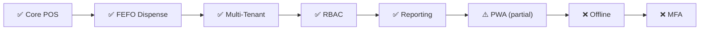
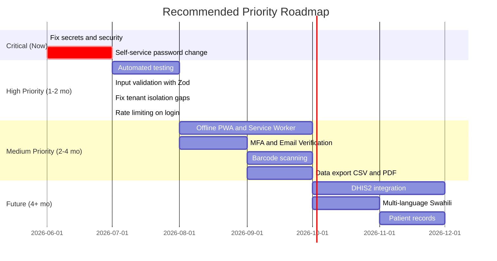

# AfyaSmart-Stock — Comprehensive Codebase Audit

**Date:** June 11, 2026  
**Application:** AfyaSmart-Stock — KEML-powered, multi-tenant pharmacy POS for Kenya  
**Stack:** Next.js 14 (App Router) · TypeScript · Prisma 7 · PostgreSQL (Neon) · Vercel  
**Version:** 0.1.0 (MVP)

---

## Executive Summary

AfyaSmart-Stock is a well-architected MVP for pharmacy point-of-sale and inventory management in Kenya. The domain model (KEML catalog → StockBatch → FEFO dispense → Sale audit trail) is sound and production-ready for its core workflows. However, the codebase has **3 critical security/quality issues** that must be fixed immediately, and several high-priority gaps that will limit its ability to scale and meet compliance requirements.

| Perspective | Critical | High | Medium | Low |
|-------------|----------|------|--------|-----|
| 🔧 Production Engineering | 2 | 7 | 7 | 4 |
| 📋 Product Management | 1 | 3 | 4 | 2 |
| 🧪 QA Engineering | 1 | 5 | 8 | 10 |
| 💼 Sales & Go-to-Market | 0 | 3 | 4 | 2 |

---

## 🔧 Perspective 1: Senior Production Engineer

### 🔴 CRITICAL Findings

#### C1. Production Database Credentials in Repository
- **File:** [.env](../.env#L5)
- **Issue:** The Neon production database URL with full password (`npg_[REDACTED]`) is present in [.env](../.env). While [.gitignore](../.gitignore) does list `.env`, if this file was ever committed before the gitignore was updated, the credential is **permanently in git history**.
- **Impact:** Anyone with repo access could have full read/write to the production database.
- **Fix:**
  1. **Verify immediately:** `git log -- .env` to check if ever tracked
  2. Rotate the Neon database password **immediately**
  3. If found in history, use BFG Repo-Cleaner to purge
  4. Move all secrets to Vercel environment variables only

#### C2. No Rate Limiting on Login
- **File:** [auth.ts](../src/lib/actions) (login action)
- **Issue:** The login endpoint has **zero rate limiting, no account lockout, no CAPTCHA**. No usage of `rateLimit` found anywhere in the codebase.
- **Impact:** Brute-force attacks against pharmacy staff accounts are trivially easy.
- **Fix:** Implement `@upstash/ratelimit` or similar on the login action.

### 🟠 HIGH Findings

#### H1. 7-Day JWT with No Revocation Mechanism
- **Files:** [jwt.ts](../src/lib/auth) · [session.ts](../src/lib/auth)
- **Issue:** Session JWT has a 7-day TTL (`SESSION_MAX_AGE_SEC = 60 * 60 * 24 * 7`). No token blocklist, no refresh token pattern. Password resets don't invalidate existing sessions.
- **Risk:** A fired pharmacy employee retains access for up to 7 days. A compromised account cannot be force-logged-out.
- **Recommendation:** Reduce TTL to 8–24 hours. Implement a server-side session version check or token blocklist on critical actions.

#### H2. Tenant Isolation Bypassed by `findUnique`
- **File:** [prisma-tenant.ts](../src/lib/prisma-tenant.ts#L23-L35)
- **Issue:** The tenant-scoped Prisma extension intercepts `findMany`, `findFirst`, `update`, `delete`, `count`, etc. — but **`findUnique` is NOT in the `scopedWhereOps` set**. A code comment warns developers to "Use findFirst (not findUnique)" but this is a convention-based guard, not an enforced one.
- **Impact:** Any developer accidentally using `findUnique` on a tenant-scoped model (StockBatch, Sale, SaleLine) will **bypass tenant isolation** and can access another tenant's data.
- **Fix:** Either add `findUnique` to `scopedWhereOps` or make the extension throw on `findUnique` for scoped models.

#### H3. Tenant Client Cache Memory Leak
- **File:** [prisma-tenant.ts](../src/lib/prisma-tenant.ts#L115)
- **Issue:** `const tenantClientCache = new Map<...>()` grows unboundedly. No LRU eviction, no max size, no TTL. In a long-running server with many tenants, this is a memory leak.
- **Fix:** Use an LRU cache (e.g., `lru-cache`) with a max size of ~100 entries.

#### H4. No Input Schema Validation (No Zod/Yup)
- **Files:** All files in [actions/](../src/lib/actions)
- **Issue:** Server actions do manual `if (!field)` checks instead of using a schema validation library. Complex inputs like `CartDispenseItem[]` in dispense are trusted at runtime.
- **Risk:** Negative quantities, unexpected types, or malformed inputs could slip through.
- **Recommendation:** Adopt Zod for all server action inputs with strict schemas.

#### H5. No Negative Stock Guard
- **File:** [schema.prisma](../prisma/schema.prisma#L119)
- **Issue:** `StockBatch.quantityOnHand` is a plain `Int` with no check constraint (`>= 0`). Prisma doesn't support native CHECK constraints, but no application-level guard exists either. A bug in dispense logic could create **negative phantom inventory**.
- **Fix:** Add `@check(quantityOnHand >= 0)` via raw SQL migration AND add application-level assertion in the dispense transaction.

#### H6. `addTeamMember` Overwrites Existing User's Password
- **File:** [team.ts](../src/lib/actions) (addTeamMember action)
- **Issue:** `tx.user.upsert()` in addTeamMember will **update passwordHash** of an existing user. If User A exists in Facility 1 and Facility 2's owner adds them as staff, Facility 2's owner can overwrite User A's password without consent.
- **Impact:** Cross-tenant password compromise.
- **Fix:** Check if user exists first; if so, skip password update or require the existing user's consent.

#### H7. Expected Errors (`AppError`) Reported to Sentry as Exceptions
- **File:** [utils.ts](../src/lib/actions) (runAction wrapper)
- **Issue:** `Sentry.captureException(error)` is called for ALL errors including `AppError` (validation errors, auth errors, insufficient stock). These are expected business conditions, not exceptional.
- **Impact:** Sentry alert noise. Real exceptions get buried under validation "errors."
- **Fix:** Only call `Sentry.captureException` for non-`AppError` instances.

### 🟡 MEDIUM Findings

| ID | Finding | File(s) |
|----|---------|---------|
| M1 | **No security headers** — No CSP, X-Frame-Options, HSTS, X-Content-Type-Options | [next.config.mjs](../next.config.mjs) |
| M2 | **Weak password policy** — min 8 chars only, no complexity requirements | [password-policy.ts](../src/lib/auth) |
| M3 | **No connection pool configuration** — `new Pool()` with default 10 max, no timeouts | [prisma.ts](../src/lib/prisma.ts) |
| M4 | **Production pool not cached on globalThis** — potential connection leak on module re-imports | [prisma.ts](../src/lib/prisma.ts#L17-L19) |
| M5 | **Dispense uses base `prisma` not tenant `db`** — manual tenantId injection is error-prone for future devs | Dispense action |
| M6 | **Raw error messages passed to client** — `getErrorMessage()` falls through to `error.message` for generic `Error`, could leak Prisma internals | [errors.ts](../src/lib/errors.ts#L42-L46) |
| M7 | **No serialization retry on dispense** — concurrent `Serializable` transactions fail without auto-retry | Dispense action |

### 🟢 LOW Findings

| ID | Finding |
|----|---------|
| L1 | **Empty `SENTRY_ORG`/`SENTRY_PROJECT`** — source map uploads silently fail |
| L2 | **No CSRF tokens** — Next.js has built-in origin checking, but explicit tokens add defense-in-depth |
| L3 | **No session refresh/sliding window** — users abruptly logged out after 7 days regardless of activity |
| L4 | **`canAccessPath` returns `true` for unknown routes** — new routes auto-allowed to all authenticated users |

---

## 📋 Perspective 2: Senior Product Manager

### Product Maturity Assessment

### What's Working Well ✅

| Feature | Assessment |
|---------|------------|
| **KEML Catalog** | 1,567 medicines + 3,654 brand aliases — comprehensive for Kenya |
| **FEFO Dispense** | Transactional, race-condition-safe with `Serializable` isolation |
| **Multi-Tenant** | Shared-DB model with proper scoping — scales to many facilities |
| **Role-Based Access** | Owner → Deputy → Dispenser hierarchy is pharmacy-appropriate |
| **Stock-Aware POS** | Real-time stock badges ("240 tablets") during search — excellent UX |
| **Audit Corrections** | Post-dispense quantity/void corrections with stock restoration |
| **Sales Dashboard** | Today's metrics, top drugs, recent sales |
| **Insights & Reports** | Sell-through analysis, printable reports (thermal + A4) |
| **Platform Admin** | Facility management, usage stats, owner password resets |
| **PWA Install Prompt** | Well-implemented install banner with deferred prompt |

### 🔴 CRITICAL Product Gap

#### P-C1. No Self-Service Password Change
- Users cannot change their own passwords. Only admins/owners can reset for others via `window.prompt()` dialogs.
- **Impact:** Breaks user trust, blocks compliance with Kenya's Data Protection Act (2019). If a password is compromised, the user depends on an admin to fix it.

### 🟠 HIGH Product Gaps

#### P-H1. No Email Verification or MFA
- No email verification on account creation. No multi-factor authentication.
- **Impact:** For a health/pharmacy application handling medicine dispensing, this is a regulatory concern.

#### P-H2. Single Facility Per User
- A user can only belong to one facility (single `Membership` row). A pharmacist working at multiple clinics needs multiple accounts.
- **Impact:** Limits adoption in scenarios where staff rotate between facilities.

#### P-H3. No Offline Capability
- PWA manifest and install prompt exist, and a basic service worker (`public/sw.js`) provides cache-first for shell pages. But there's no offline data sync — dispensing, receiving, and searching all require network connectivity.
- **Impact:** Major barrier for the target market (Kenyan health facilities often have unreliable internet). Eliminates ~40-60% of potential market.

### 🟡 MEDIUM Product Gaps

| ID | Gap | Impact |
|----|-----|--------|
| PM-M1 | **No barcode scanning** | Manual medicine lookup is slower at busy pharmacies |
| PM-M2 | **No reorder point alerts** | Staff must manually check for low stock |
| PM-M3 | **No patient records** | Can't track prescriptions per patient (needed for controlled substances) |
| PM-M4 | **No data export** | No CSV/PDF export of stock or sales data |

### 🟢 LOW Product Gaps

| ID | Gap | Notes |
|----|-----|-------|
| PM-L1 | No notification system (email/SMS) | For expiry or low stock alerts |
| PM-L2 | No multi-language support | English only; Swahili would broaden adoption |

### Product Roadmap Recommendation

---

## 🧪 Perspective 3: Senior QA Engineer

### 🔴 CRITICAL

#### QA-C1. Zero Test Coverage
- **No test files exist anywhere in the project.** No unit tests, integration tests, end-to-end tests. No test runner configured (no Jest, Vitest, Playwright, or Cypress).
- **Impact:** Every deployment is a leap of faith. The FEFO dispense algorithm, tenant isolation, RBAC logic, and stock calculations are complex enough that they **must** be tested.

> [!CAUTION]
> A pharmacy application handling medicine dispensing with **zero automated tests** is an unacceptable risk. A bug in FEFO allocation could lead to incorrect dispensing of expired medicines.

### 🟠 HIGH Findings

#### QA-H1. No Route-Level `error.tsx` Files
- Only `global-error.tsx` exists. Individual route errors show a generic Sentry/Next error page instead of route-specific recovery UI.
- A transient network error on `/sales` will show the same generic page as a crash on `/pos`.

#### QA-H2. Cart State Lost on Page Refresh
- **File:** [cart-store.ts](../src/stores)
- Zustand store has no `persist` middleware. An accidental page refresh clears the entire POS cart mid-transaction.
- **Fix:** Add `persist` with `localStorage` backend.

#### QA-H3. Admin/Team Form Inputs Missing `<label>` Elements
- **Files:** [admin-console.tsx](../src/components/admin), [team-settings.tsx](../src/components/settings)
- All 5 inputs in "Add facility" form and 3 inputs in "Add staff" form use only `placeholder` — no associated `<label>` elements. Screen readers won't announce what each field is for.
- Role `<select>` elements also lack labels.

#### QA-H4. Login Errors Only Shown as Toast Notifications
- **File:** [login-form.tsx](../src/components/auth)
- Failed login shows error only via Sonner toast. Screen reader users, or users who miss the transient toast, won't see the error near the field.

#### QA-H5. No Rate Limiting on Login
- (Cross-referenced with Production Engineering C2)

### 🟡 MEDIUM Findings

| ID | Finding | Location |
|----|---------|----------|
| QA-M1 | No `loading.tsx` skeleton screens on any routes | All `src/app/*/` routes |
| QA-M2 | No skip-to-content link for keyboard users | [app-shell-client.tsx](../src/components/layout) |
| QA-M3 | No focus trap on mobile nav drawer | [app-shell-client.tsx](../src/components/layout) |
| QA-M4 | Admin "Add facility" doesn't validate password policy client-side | [admin-console.tsx](../src/components/admin) |
| QA-M5 | Sales correction reason labeled "(required)" but no client-side check | [sales-dashboard.tsx](../src/components/sales) |
| QA-M6 | Dark mode configured but not implemented — dead `darkMode: ["class"]` | [tailwind.config.ts](../tailwind.config.ts) |
| QA-M7 | `/settings` route would 404 — no redirect to `/settings/team` | [settings/](../src/app/settings) |
| QA-M8 | Contact email falls back to `hello@afyasmart.local` placeholder if env not set | [landing-page.tsx](../src/components/marketing) |

### 🟢 LOW Findings

| ID | Finding |
|----|---------|
| QA-L1 | No custom 404 page |
| QA-L2 | No Escape key handler on mobile drawer |
| QA-L3 | Login form relies on `type="email"` only for email validation |
| QA-L4 | Admin form doesn't validate slug format |
| QA-L5 | No `aria-current` on landing page nav links |
| QA-L6 | No smooth scroll for `#features` anchor |
| QA-L7 | Sale correction inputs remain editable during mutation |
| QA-L8 | Some types defined in action files rather than centralized `types.ts` |
| QA-L9 | Service worker cache key `afyasmart-pwa-v1` hardcoded — no versioning strategy |
| QA-L10 | Some `any` types in TypeScript |

### ✅ QA Strengths Worth Noting

| Area | Detail |
|------|--------|
| **Component reusability** | 13 Shadcn UI primitives + `MedicineCatalogSearch` with `variant` prop + `ResetPasswordDialog` reused across admin/team |
| **Print system** | Dedicated thermal receipt (80mm) + A4 report CSS with proper page breaks |
| **Cart logic** | Duplicate batch prevention, quantity clamping, clean Zustand pattern |
| **Responsive layout** | Desktop fixed sidebar + mobile slide-out drawer with body scroll lock |
| **Permission-based nav** | Sidebar filters routes by `canAccessNav(session, item.navId)` |
| **PWA install prompt** | Proper deferred prompt, dismiss persistence, standalone detection |
| **Landing page** | Server component with proper semantic HTML, OpenGraph metadata, safe-area handling |

### Recommended Test Strategy

| Layer | Tool | Priority Targets |
|-------|------|-----------------|
| **Unit** | Vitest | FEFO allocation, stock-unit formatting, permission checks, money calculations, cart store logic |
| **Integration** | Vitest + Prisma | Dispense transaction (race conditions), tenant isolation (findUnique bypass), auth flows, password overwrite bug |
| **E2E** | Playwright | Login → Receive → Dispense → Sale correction full workflow |
| **Accessibility** | axe-core + Playwright | All pages, focus management, keyboard navigation, label associations |

---

## 💼 Perspective 4: Senior Sales Manager

### Market Position & Competitive Analysis

**Target Market:** Kenyan health facilities — pharmacies, dispensaries, county hospitals  
**TAM Estimate:** ~12,000 licensed pharmacies + ~10,000 health facilities in Kenya  
**Positioning:** KEML-native, affordable, cloud-hosted pharmacy POS

### 🟢 Key Selling Points

| Selling Point | Why It Matters |
|---------------|----------------|
| **KEML 2023 built-in** | No manual drug catalog setup — pharmacists start immediately |
| **Brand name search** | 3,654+ aliases — type "Panadol" or "Septrin" and it maps to the generic |
| **FEFO automation** | Nearest-expiring stock dispensed first — reduces waste, meets regulatory expectations |
| **Multi-facility platform** | One system for chains, county hospital networks, or NGO-managed clinics |
| **Role-based access** | Owner, Deputy, Dispenser — fits actual pharmacy staffing models |
| **Stock-aware POS** | Real-time badges showing what's in stock — prevents "sorry, we're out" moments |
| **Vercel + Neon** | No self-hosting needed — facilities just need a browser and internet |
| **Low cost infrastructure** | Neon free tier + Vercel hobby handles small facilities at near-zero cost |
| **Printable reports** | Thermal receipts + A4 reports — works with existing hardware |
| **Kenyan-first design** | Built specifically for KEML, Kenyan facility hierarchy, KES currency |

### 🟠 HIGH Sales Barriers

#### S-H1. No Offline Mode — Dealbreaker for Rural Kenya
- Many Kenyan health facilities (especially Level 2-3) have intermittent or no internet.
- Without offline dispensing, the system cannot be used during outages — which may happen daily.
- **Impact:** Eliminates ~40-60% of the target market.

#### S-H2. No Mobile-First Experience
- While the web app is responsive, there's no dedicated mobile app or full offline PWA with data sync.
- Pharmacy staff in smaller facilities often use smartphones, not desktops.
- **Impact:** Limits adoption where desktop computers are unavailable.

#### S-H3. No Integration with Government Systems
- No integration with Kenya's DHIS2 (health data reporting) or PPB reporting.
- Pharmacies must report stock levels and dispensing data to regulatory bodies.
- **Impact:** Doesn't eliminate government reporting burden — a key sales objection ("I still have to do manual reporting on top of this?").

### 🟡 MEDIUM Sales Gaps

| ID | Gap | Sales Impact |
|----|-----|-------------|
| S-M1 | **No pricing/subscription model** visible | Prospects don't know the cost — friction in sales conversations |
| S-M2 | **No demo environment** | No way for prospects to try before committing |
| S-M3 | **No onboarding wizard** | New facilities face a technical setup process — needs white-glove onboarding |
| S-M4 | **No multi-language** | Swahili-speaking pharmacists may prefer localized UI |

### 🟢 LOW Sales Considerations

| ID | Item |
|----|------|
| S-L1 | No customer testimonials or case studies (too early) |
| S-L2 | No comparison page vs. competitors (e.g., mPharma, PharmAccess tools) |

### Competitive Landscape

| Competitor | Strengths | AfyaSmart Advantage |
|-----------|-----------|---------------------|
| **mPharma** | Funded, established, Pan-African | KEML-native, no hardware requirement, lower cost |
| **PharmAccess** | NGO-backed, health financing integration | Pure POS focus, simpler to adopt and deploy |
| **Paper-based** (status quo) | Free, works offline, no training needed | FEFO automation, audit trail, multi-facility visibility |
| **Generic POS** (e.g., Square) | Mature, payment integration, mobile app | Pharmacy-specific: KEML, batch expiry, stock units, regulatory fit |

### Sales Readiness Scorecard

| Dimension | Score | Notes |
|-----------|-------|-------|
| Product-Market Fit | ⭐⭐⭐⭐ | Strong for urban Kenyan pharmacies |
| Technical Readiness | ⭐⭐⭐ | Production-grade core, but missing tests & security hardening |
| Go-to-Market Readiness | ⭐⭐ | No pricing page, no demo env, no self-service onboarding |
| Compliance Readiness | ⭐⭐ | No MFA, no comprehensive audit logs, no DHIS2 integration |
| Market Coverage | ⭐⭐ | Urban only (no offline), English only |

---

## 🔍 Data & Schema Deep-Dive Findings

### Data Quality Issues

| ID | Issue | Files | Severity |
|----|-------|-------|----------|
| D1 | **"Ww Warfarin" typo systemic across ALL data files** — appears in KEML JSON, CSV, aliases, and index | All files in [data/](../data) | MEDIUM |
| D2 | **Duplicate generics in seed-stock** — "Glucose" and "Zinc sulphate" appear twice | [seed-stock.ts](../prisma/seed-stock.ts) | LOW |
| D3 | **All demo stock uses `stockUnit: "TABLET"`** — incorrect for IVs, creams, inhalers | [seed-stock.ts](../prisma/seed-stock.ts) | LOW |
| D4 | **`clean_index_names.json` is dead data** — not seeded, not referenced | [data/](../data) | LOW |

### Schema Integrity Gaps

| ID | Issue | Severity |
|----|-------|----------|
| S1 | `tenantId` defaults to `"default"` on StockBatch, Sale, SaleLine — silent data corruption if tenant extension is bypassed | MEDIUM |
| S2 | No index on `SaleLine.stockBatchId` — batch reconciliation queries will be slow at scale | MEDIUM |
| S3 | Missing `updatedAt` on `Tenant`, `MedicineAlias`, `Sale` | LOW |
| S4 | `SaleLine.updatedAt` has redundant `@default(now())` AND `@updatedAt` | LOW |
| S5 | No soft-delete on `StockBatch` (no way to mark recalled/removed batches) | LOW |

### Seed Script Issues

| ID | Issue | Severity |
|----|-------|----------|
| SS1 | Active `migrate-to-multitenant.ts` lacks `$transaction` wrapping — deferred version in `deferred/` is better | MEDIUM |
| SS2 | `neon-multitenant-setup.ts` uses `--accept-data-loss` with no environment guard | HIGH |
| SS3 | Default credentials (`ChangeMeAdmin1!`) with no forced change on first login | HIGH |

---

## Consolidated Action Items

### 🔴 Immediate — This Week

| # | Action | Owner | Effort |
|---|--------|-------|--------|
| 1 | **Verify `.env` git history** (`git log -- .env`) and rotate Neon DB password if ever committed | DevOps | 1h |
| 2 | **Add rate limiting** on login action (e.g., `@upstash/ratelimit`) | Engineering | 2h |
| 3 | **Fix `findUnique` tenant bypass** — add to `scopedWhereOps` or throw on scoped models | Engineering | 1h |

### 🟠 High Priority — Next 2 Weeks

| # | Action | Owner | Effort |
|---|--------|-------|--------|
| 4 | **Add Vitest** + tests for FEFO, tenant isolation, RBAC, cart store | Engineering | 3d |
| 5 | **Adopt Zod** for all server action input validation | Engineering | 2d |
| 6 | **Reduce JWT TTL** to 24h; add session version check | Engineering | 4h |
| 7 | **Fix `addTeamMember` password overwrite** — check existing user before upserting | Engineering | 2h |
| 8 | **Add `<label>` elements** to all admin/team form inputs | Frontend | 2h |
| 9 | **Stop reporting `AppError` to Sentry** — only capture unexpected exceptions | Engineering | 1h |
| 10 | **Persist cart store** with Zustand `persist` middleware | Frontend | 1h |
| 11 | **Add negative stock guard** — CHECK constraint + application assertion | Engineering | 2h |

### 🟡 Medium Priority — Next 1-2 Months

| # | Action | Owner | Effort |
|---|--------|-------|--------|
| 12 | Implement self-service password change for all users | Product + Eng | 2d |
| 13 | Add route-level `error.tsx` files | Frontend | 1d |
| 14 | Add `loading.tsx` skeleton screens | Frontend | 1d |
| 15 | Add security headers (CSP, HSTS, X-Frame-Options) | Engineering | 4h |
| 16 | Configure connection pool sizing and timeouts | Engineering | 2h |
| 17 | Implement PostgreSQL RLS as defense-in-depth | Engineering | 2d |
| 18 | Add LRU eviction to tenant client cache | Engineering | 2h |
| 19 | Add serialization retry logic on dispense | Engineering | 4h |
| 20 | Fix "Ww Warfarin" typo across all data files | Data | 1h |
| 21 | Replace `window.prompt()` with inline password reset forms | Frontend | 4h |
| 22 | Add skip-to-content link and focus trap on mobile nav | Frontend | 2h |
| 23 | Add custom 404 page | Frontend | 1h |

### 🟢 Future — 3+ Months

| # | Action | Owner | Effort |
|---|--------|-------|--------|
| 24 | MFA / email verification | Engineering | 1w |
| 25 | Offline PWA with data sync (service worker + IndexedDB) | Engineering | 2-3w |
| 26 | Barcode scanning (camera-based) | Product + Eng | 1w |
| 27 | DHIS2 integration | Product + Eng | 2w |
| 28 | Multi-language (Swahili) | Product + Eng | 1w |
| 29 | CSV/PDF data export | Engineering | 3d |
| 30 | Demo environment for sales | Sales + DevOps | 2d |
| 31 | Multi-facility per user | Engineering | 1w |
| 32 | Structured logging (Pino) | Engineering | 2d |
| 33 | E2E tests with Playwright | QA | 1w |

---

## Architecture Strengths Worth Preserving

> [!TIP]
> These design decisions are solid and should be maintained as the product evolves.

1. **KEML as shared catalog** — separating "what can be dispensed" from "what's in stock" is the right abstraction
2. **FEFO with Serializable transactions** — correct for health-tech inventory integrity
3. **Prisma tenant extension pattern** — clean approach for shared-DB multi-tenancy (needs `findUnique` fix)
4. **Server Actions with `runAction()` wrapper** — consistent error handling and Sentry integration
5. **Zustand for POS cart** — minimal, fast, appropriate for client-side transient state
6. **Role hierarchy** (Owner → Deputy → Dispenser) — matches real pharmacy staffing in Kenya
7. **`SaleLine` snapshots** — freezing drug name/form/strength at dispense preserves audit integrity
8. **`onDelete: Restrict`** on operational tables — prevents accidental cascade deletions of active data
9. **Stock unit system** — explicit counting units (TABLET, BOX, etc.) prevent dispensing ambiguity
10. **Comprehensive Prisma indexing** — 14 indexes covering all major query patterns including FEFO and tenant-scoped dashboards

---

*Report generated from comprehensive analysis of all source files, configuration, schema, seed scripts, data files, and documentation across the AfyaSmart-Stock codebase.*
