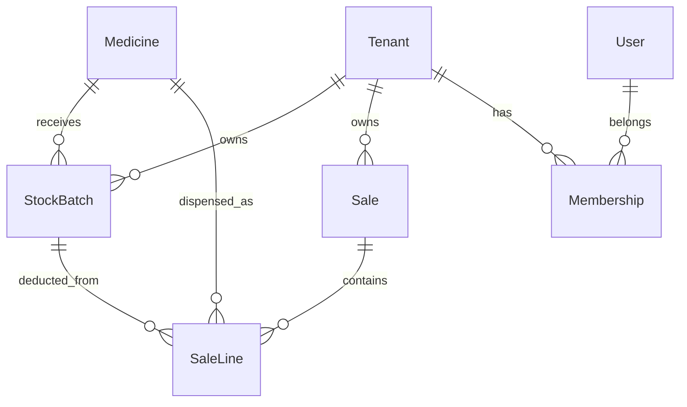

# AfyaSmart-Stock — Complete Project Documentation

**Last updated:** May 2026  
**Status:** Production-ready MVP — multi-tenant, authenticated, deployed on Vercel + Neon

---

## Table of contents

1. [What we built](#1-what-we-built)
2. [Repository layout](#2-repository-layout)
3. [KEML reference data](#3-keml-reference-data)
4. [Application stack](#4-application-stack)
5. [Authentication & IAM](#5-authentication--iam)
6. [Multi-tenancy](#6-multi-tenancy)
7. [Database schema](#7-database-schema)
8. [Stock counting units](#8-stock-counting-units)
9. [Routes & user journeys](#9-routes--user-journeys)
10. [Server actions API](#10-server-actions-api)
11. [UI & UX](#11-ui--ux)
12. [Seeding & sample data](#12-seeding--sample-data)
13. [Build history (phases)](#13-build-history-phases)
14. [Operations guide](#14-operations-guide)
15. [Deploy (Vercel + Neon)](#15-deploy-vercel--neon)
16. [Known gaps & future work](#16-known-gaps--future-work)
17. [Related documents](#17-related-documents)
18. [PWA & Offline Architecture](#18-pwa--offline-architecture)

---

## 1. What we built

**AfyaSmart-Stock** is a pharmacy **point-of-sale and stock** system for Kenyan health facilities. It uses **KEML 2023** as a shared **catalog** (drug name + formulation). Each **facility (tenant)** keeps its own batches, sales, and staff accounts.

| Capability | Summary |
|------------|---------|
| **KEML catalog** | ~1,567 medicines seeded; ~1,459 searchable in POS/receive |
| **Brand alias search** | ~3,654 aliases; type Panadol, Septrin, Coartem, etc. |
| **Multi-tenant isolation** | Shared DB + `tenantId` on stock and sales |
| **Login & roles** | JWT session cookie; platform admin + facility owner/deputy/dispenser |
| **Receive stock** | Search catalog → batch, qty, **stock unit** (tablet/box/etc.), expiry, costs |
| **FEFO dispense** | POS cart → transactional deduct + priced sale log |
| **Stock-aware POS search** | Typing “paracetamol” shows which formulations are **in stock** per facility |
| **Sales & insights** | Today’s metrics, top drugs, receive/sell-through, printable reports |
| **Platform admin** | List facilities, 30-day usage, create facilities, reset **owner** passwords only |
| **Facility team** | Owner adds up to **3** staff (deputy + dispensers), assigns roles, resets staff passwords |
| **Telemetry** | Sentry on server actions (includes `tenantId` tag when available) |

```mermaid
flowchart TB
  subgraph platform [Platform]
    SA[Super user admin@afyasmart.local]
    SA --> Admin[/admin]
  end
  subgraph facility [Facility tenant]
    O[Owner]
    D[Deputy]
    P[Dispenser x2]
    O --> Team[/settings/team]
    O --> Receive[/receive]
    D --> Receive
    D --> Reports[/reports]
    P --> POS[/pos]
  end
  KEML[(Medicine catalog global)] --> Receive
  KEML --> POS
  Receive --> StockBatch[(StockBatch per tenantId)]
  POS --> Sale[(Sale per tenantId)]
```

---

## 2. Repository layout

**Git root and Vercel root:** this folder (`afyasmart-app/`).

```
afyasmart-app/
├── README.md                  ← Quick start
├── CHANGELOG.md               ← Release history
├── docs/
│   ├── DOCUMENTATION.md       ← Master reference (this file)
│   ├── ARCHITECTURE.md        ← FEFO, transactions, tenancy
│   ├── ACHIEVEMENTS.md        ← Executive summary
│   ├── FRONTEND.md            ← UI components & routes
│   └── catalog-ingestion.md   ← Hybrid / KEMSA pipeline
├── data/                      ← KEML + alias JSON
├── prisma/
│   ├── schema.prisma
│   ├── seed.ts
│   ├── seed-stock.ts
│   ├── seed-aliases.ts
│   ├── seed-tenants.ts        ← Demo facilities
│   ├── seed-auth.ts           ← Super user + demo owners
│   ├── migrate-to-multitenant.ts
│   └── neon-multitenant-setup.ts
├── deferred/multitenant/      ← Historical reference only
├── src/
│   ├── app/                   ← Routes incl. /login, /admin
│   ├── components/
│   ├── lib/
│   │   ├── actions/
│   │   ├── auth/              ← session, JWT, permissions
│   │   ├── prisma-tenant.ts   ← Tenant-scoped Prisma extension
│   │   └── stock-unit.ts
│   └── middleware.ts          ← Auth + RBAC route guard
└── vercel.json
```

---

## 3. KEML reference data

| File | Records | Used by |
|------|---------|---------|
| `data/final_keml_2023.json` | 1,576 | `npm run db:seed` |
| `data/alias_names.json` | 695 | `npm run db:seed-aliases` |

**Stubs** (`isStub: true`): placeholder form/strength — hidden from search (~108 rows).

KEML = **what can be dispensed**. **Stock** = `StockBatch` per facility via Receive or `db:seed-stock`.

---

## 4. Application stack

| Layer | Technology |
|-------|------------|
| Framework | Next.js 14 (App Router) |
| Language | TypeScript (strict) |
| UI | Tailwind, Shadcn, Lucide, Sonner |
| Auth | bcryptjs + jose (HTTP-only session cookie) |
| ORM | Prisma 7 + `@prisma/adapter-pg` + `pg` |
| Database | PostgreSQL (local dev + **Neon** production) |
| Observability | Sentry + `runAction()` |

### Environment variables

| Variable | Required | Purpose |
|----------|----------|---------|
| `DATABASE_URL` | Yes | PostgreSQL (Neon pooled in prod) |
| `AUTH_SECRET` | Yes | Min 16 chars — signs session JWT |
| `SENTRY_DSN` / `NEXT_PUBLIC_SENTRY_DSN` | Optional | Error reporting |
| `NEXT_PUBLIC_FACILITY_NAME` | Optional | Legacy display; session shows tenant name |
| `SUPER_EMAIL` / `SUPER_PASSWORD` | Optional | Override defaults when running `db:seed-auth` |

Prisma loads `.env.local` first, then `.env`.

### NPM scripts

| Command | Purpose |
|---------|---------|
| `npm run dev` | Development server |
| `npm run build` | Production build |
| `npm run db:push` | Apply schema (active `DATABASE_URL`) |
| `npm run db:push:local` | Schema → local Postgres only |
| `npm run db:seed` | Import KEML medicines |
| `npm run db:seed-aliases` | Brand aliases |
| `npm run db:seed-stock` | Sample stock (uses `TENANT_ID` or `default`) |
| `npm run db:seed-tenants` | Demo facility rows |
| `npm run db:seed-auth` | Super user + demo owners |
| `npm run db:migrate-multitenant` | Backfill `tenantId` on existing rows |
| `npm run db:neon:multitenant` | Neon brownfield: tenant row + push + seed tenants |
| `npm run db:neon:setup` | Push + KEML + aliases on Neon |
| `npm run db:generate` | Regenerate Prisma client |

---

## 5. Authentication & IAM

### Session

- **Cookie:** `afyasmart_session` (HTTP-only, 7-day JWT via `AUTH_SECRET`)
- **Login:** `/login` → `login()` server action
- **Middleware:** `src/middleware.ts` — redirects unauthenticated users; enforces route permissions

### Account types

| Type | How identified | Landing route |
|------|----------------|---------------|
| **Platform admin** | `User.isPlatformAdmin = true` | `/admin` |
| **Facility user** | `Membership` row (one facility per user) | `/` (menu filtered by role) |

### Roles (`TenantRole`)

| Role | Permissions |
|------|-------------|
| **OWNER** | Everything at facility + **Team** (`/settings/team`) — manage up to 3 staff |
| **DEPUTY** | Dashboard, receive, dispense, sales, insights, reports |
| **DISPENSER** | Dashboard + **POS only** |

Permissions are enforced in:

- `src/lib/auth/permissions.ts` — `hasPermission`, `canAccessNav`, `canAccessPath`
- `src/lib/auth/guards.ts` — `requireTenantContext`, `requirePlatformAdmin`, `requireFacilityOwner`
- Every operational server action (via `requireTenantContext`)

### Password management

| Actor | Can reset passwords for |
|-------|-------------------------|
| **Super user** | Facility **owners** only (`resetFacilityOwnerPassword`) |
| **Owner** | **Staff** on their team — deputy & dispensers (`resetTeamMemberPassword`) |

Owners **cannot** create another owner. Super user **cannot** reset deputy/dispenser passwords (owners do that).

### Default seeded credentials (`npm run db:seed-auth`)

| Account | Email | Password |
|---------|--------|----------|
| Super user | `admin@afyasmart.local` | `ChangeMeAdmin1!` |
| Demo owner (Default) | `owner@default.local` | `ChangeMeOwner1!` |
| Demo owner (Kakamega) | `owner@kakamega.local` | `ChangeMeOwner1!` |

Change these immediately in production. Override at seed time with `SUPER_EMAIL` / `SUPER_PASSWORD`.

### UI

- `PasswordInput` — show/hide toggle on login, admin create-facility, team add-member
- Sign out in sidebar footer

---

## 6. Multi-tenancy

**Model:** Shared database, **tenant key isolation** on operational tables.

| Data | Scope |
|------|--------|
| `Medicine`, `MedicineAlias` | **Global** (KEML) |
| `StockBatch`, `Sale`, `SaleLine` | **`tenantId` required** |
| `Tenant`, `User`, `Membership` | Identity |

### Runtime isolation

`getTenantPrisma(tenantId)` (`src/lib/prisma-tenant.ts`) extends Prisma to inject `tenantId` on all queries/creates for scoped models.

`getActiveTenantId()` reads the signed-in user’s facility from the session (not `TENANT_ID` env in production).

### Demo facilities (`npm run db:seed-tenants`)

| id | Name | slug |
|----|------|------|
| `default` | Default Facility | `default` |
| `facility-a` | Kakamega General Pharmacy | `kakamega` |
| `facility-b` | Kisumu County Dispensary | `kisumu` |
| `facility-c` | Nairobi Central Pharmacy | `nairobi` |
| `facility-d` | Mombasa Coast Clinic | `mombasa` |

### Concurrent access

Multiple facilities and users read/write in parallel. Postgres MVCC handles concurrency; dispense uses **Serializable** transactions and `FOR UPDATE` on batches. Isolation = correct `tenantId` on every operational query.

---

## 7. Database schema

### Identity

- **Tenant** — facility (`name`, `slug`)
- **User** — `email`, `passwordHash`, `isPlatformAdmin`
- **Membership** — `tenantId` + `userId` + `role` (`@@unique([tenantId, userId])`)

### Catalog

- **Medicine** — KEML row (`searchKey`, `isStub`)
- **MedicineAlias** — brand names

### Operations (tenant-scoped)

- **StockBatch** — `tenantId`, `stockUnit`, `unitsPerPack`, qty, expiry, prices
- **Sale** — `tenantId`, `totalAmount`
- **SaleLine** — `tenantId`, snapshots, `stockUnit`, `status`, `correctionNote`



---

## 8. Stock counting units

Staff count stock in explicit units so “5” always means five **tablets**, five **boxes**, etc.

### Enum `StockUnit`

`TABLET`, `CAPSULE`, `STRIP`, `BOX`, `BOTTLE`, `VIAL`, `TUBE`, `SACHET`, `UNIT`

### Fields

- `StockBatch.stockUnit` — how `quantityOnHand` is counted
- `StockBatch.unitsPerPack` — optional (e.g. 100 tablets per box)
- `SaleLine.stockUnit` / `unitsPerPack` — snapshot at dispense

### Helpers

`src/lib/stock-unit.ts` — labels, `formatQuantityWithUnit`, `summarizeStockByUnit`, `summarizeCartByUnit`, POS/receive UI badges.

---

## 9. Routes & user journeys

| Route | Who | Purpose |
|-------|-----|---------|
| **`/login`** | Public | Email + password sign-in |
| **`/admin`** | Platform admin | Facilities, usage, create facility, reset owner passwords |
| **`/`** | Owner, deputy, dispenser* | Operations dashboard (*dispenser: limited) |
| **`/receive`** | Owner, deputy | Receive stock with unit + pricing |
| **`/pos`** | All facility roles | Dispense; **stock-aware catalog search** |
| **`/sales`** | Owner, deputy | Today’s sales, top drugs, audit corrections |
| **`/insights`** | Owner, deputy | Receive history, sell-through, restock trends |
| **`/reports`** | Owner, deputy | Printable weekly/monthly sales + stock reports |
| **`/settings/team`** | Owner only | Add/remove up to 3 staff, roles, reset staff passwords |

### POS stock-aware search

When `MedicineCatalogSearch` runs with `variant="dispense"`:

- Loads live stock per formulation for **current tenant**
- Green badges: e.g. `240 tablets`, `10 boxes + 50 tablets`
- Sorts **in stock** first; out-of-stock formulary rows shown disabled
- Hint when multiple paracetamol (etc.) formulations match

---

## 10. Server actions API

All use `ActionResult<T>` + `runAction()` + Sentry (optional `tenantId` tag).

### Auth (`auth.ts`)

| Action | Description |
|--------|-------------|
| `login(email, password)` | Verify bcrypt; set session cookie |
| `logout()` | Clear session |
| `getCurrentUser()` | Session summary for UI |

### Admin (`admin.ts`) — platform admin only

| Action | Description |
|--------|-------------|
| `listFacilities()` | All tenants + owner + 30d usage stats |
| `createFacility(...)` | New tenant + owner user + membership |
| `resetFacilityOwnerPassword(...)` | Owner role only |

### Team (`team.ts`) — facility owner only

| Action | Description |
|--------|-------------|
| `listTeamMembers()` | Staff list + slots remaining (max 3) |
| `addTeamMember(...)` | DEPUTY or DISPENSER |
| `updateTeamMemberRole(...)` | Switch deputy ↔ dispenser |
| `removeTeamMember(...)` | Delete membership |
| `resetTeamMemberPassword(...)` | Staff only |

### Catalog (`catalog.ts`)

| Action | Description |
|--------|-------------|
| `searchCatalog(query, { withStock? })` | KEML search; `withStock` adds tenant stock totals (POS) |
| `getBatchesForMedicine(id)` | FEFO batches for tenant |

### Inventory, dispense, sales, insights, reports

Same as before, but all require auth + permission + tenant scope via `requireTenantContext`.

**Dispense** raw SQL includes `"tenantId"` filter for defense in depth.

---

## 11. UI & UX

| Component | Role |
|-----------|------|
| `AppShell` | Server wrapper → `AppShellClient` with session-based nav |
| `MedicineCatalogSearch` | `variant="dispense"` \| `"receive"` |
| `PasswordInput` | Show/hide password |
| `AdminConsole` | Platform facility management |
| `TeamSettings` | Owner staff IAM |
| `StockUnitSelect` / `StockUnitBadge` | Unit labels across app |

Sidebar shows only routes the role may access. Facility name from session.

Details: [`FRONTEND.md`](./FRONTEND.md)

---

## 12. Seeding & sample data

### Recommended full setup (local)

```bash
cp .env.example .env .env.local
# Set DATABASE_URL (local), AUTH_SECRET (16+ chars)

npm install
npx prisma db push
npm run db:seed
npm run db:seed-aliases
npm run db:seed-tenants
npm run db:seed-auth
npm run db:seed-stock
npm run dev
```

### Neon (production)

```bash
# Use Neon URL from .env (avoid .env.local overriding)
export DATABASE_URL="<neon-pooled-url>"
npx prisma db push --accept-data-loss
npm run db:seed
npm run db:seed-aliases
npm run db:seed-tenants
npm run db:seed-auth
```

Set `AUTH_SECRET` in Vercel environment variables.

---

## 13. Build history (phases)

| Phase | Deliverable |
|-------|-------------|
| 0–4 | MVP: KEML, receive, FEFO POS, dashboard, receipt |
| 5 | Sales dashboard, pricing, supplier, audit |
| 6 | Insights, printable reports |
| 7 | **Stock units** across receive, POS, reports |
| 8 | **Multi-tenant** schema + Prisma tenant extension |
| 9 | **POS stock-aware search** (formulation + in-stock tags) |
| 10 | **Auth + IAM**: login, super admin, owner team (3 staff), RBAC |
| 11 | Password show/hide toggle; Neon auth schema + seed |

---

## 14. Operations guide

### Daily workflow (facility user)

1. Sign in at `/login`.
2. **Receive** deliveries at `/receive`.
3. Check **Dashboard** for expiry/low stock.
4. **Dispense** at `/pos` (use stock badges to pick formulation).
5. **Sales** / **Insights** / **Reports** as needed.
6. Owner: manage **Team** at `/settings/team`.

### Platform admin

1. Sign in as `admin@afyasmart.local` → `/admin`.
2. Create facilities or reset owner passwords.
3. Do not use facility POS routes (middleware redirects to `/admin`).

### Dev troubleshooting

**Stale Next cache:**

```bash
rm -rf .next && npm run dev
```

**Auth errors:** ensure `AUTH_SECRET` is set.

---

## 15. Deploy (Vercel + Neon)

1. Connect repo; root = `afyasmart-app` (or monorepo subfolder).
2. **Environment variables:**
   - `DATABASE_URL` — Neon **pooled** URL
   - `AUTH_SECRET` — long random string (required)
   - Optional: Sentry DSNs
3. One-time against Neon (from dev machine):

   ```bash
   export DATABASE_URL="<neon-url>"
   npx prisma db push --accept-data-loss
   npm run db:seed && npm run db:seed-aliases
   npm run db:seed-tenants && npm run db:seed-auth
   ```

4. Redeploy after env changes.

---

## 16. Known gaps & future work

| Gap | Notes |
|-----|-------|
| Owner self-service password change | Super user / owner reset only |
| Email verification / MFA | Not implemented |
| Multi-facility per user | One membership per user today |
| PostgreSQL RLS | App-layer isolation only (optional hardening) |
| Barcode scan | Not implemented |
| Prompt-based password reset UX | Admin/team use `window.prompt`; could be inline forms |

---

## 17. Related documents

| Document | Purpose |
|----------|---------|
| [`ARCHITECTURE.md`](./ARCHITECTURE.md) | FEFO, transactions, tenancy, auth design |
| [`FRONTEND.md`](./FRONTEND.md) | Components, routes, UI decisions |
| [`ACHIEVEMENTS.md`](./ACHIEVEMENTS.md) | Executive deliverables summary |
| [`catalog-ingestion.md`](./catalog-ingestion.md) | Hybrid / KEMSA catalog pipeline |
| [`bulk-delivery-import.md`](./bulk-delivery-import.md) | Bulk delivery receive |
| [`README.md`](../README.md) | Quick start |
| [`CHANGELOG.md`](../CHANGELOG.md) | Release history |
| [`.cursorrules`](../.cursorrules) | Dev standards |

---

## 18. PWA & Offline Architecture

AfyaSmart-Stock features a full-fledged offline data layer that allows Level 2–4 health facilities to execute their core POS workflows during internet connectivity blackouts. 

### 18.1 Service Worker & Asset Caching (`public/sw.js`)
* **Static Assets:** The service worker caches static Next.js assets (`/_next/static/*`) using a stale-while-revalidate strategy. This ensures JS bundles, CSS, and fonts are preserved in local storage and load instantaneously.
* **Shell Pre-caching:** Install-time pre-caching is applied to static shell paths (`/`, `/login`, `/offline`, `/icon.svg`, `/apple-icon.svg`).
* **Offline Fallback Route:** If navigation requests fail and no cache is present, the Service Worker intercepts the request and serves a dedicated, cached static `/offline` page.

### 18.2 IndexedDB Schema (`src/lib/offline/db.ts`)
We use a versioned IndexedDB database `"afyasmart-offline"` to store local state:
1. `catalog_medicines`: Cached KEML medicines with the `searchKey` index (prefix-scan matching).
2. `tenant_stock`: Cached batch inventory keyed by `[tenantId, batchId]`, indexed by `[tenantId, medicineId, expiryDate]` for FEFO query execution.
3. `pending_queue`: Pending sales/inventory operations keyed by local autoincrement ID, indexed by `[tenantId, createdAt]` and `status`.
4. `sync_meta`: Last cached/synced timestamps for data freshness tracking.

### 18.3 Offline Data Caches & Queue
* **Catalog Cache (`catalog-cache.ts`):** Bulk-seeds KEML medicines from `/api/offline/catalog` on first load/online event. Offline prefix scans are run using `IDBKeyRange.bound(query, query + "\uffff")`.
* **Stock Cache (`stock-cache.ts`):** Automatically caches batches returned by online catalog searches. Optimistic stock levels are decremented immediately when an offline sale is completed, and rolled back if a server sync rejects the sale.
* **Sync Queue (`sync-queue.ts`):** Manages offline operations using lifecycle states: `pending` → `syncing` → `synced` / `failed`. Aborts items older than 24 hours to prevent stale dispenses.

### 18.4 Offline POS Workflow
1. **Network Detection:** The POS client detects connection status via the custom hook `useNetworkStatus()` (which listens to `online` and `offline` browser events).
2. **Catalog Lookup:** Automatically falls back to IndexedDB scan `searchOfflineCatalog(db, query)` if offline.
3. **Batch FEFO Picker:** If offline, queries cached batches sorted by nearest expiry date via `getOfflineBatchesForMedicine(db, tenantId, medicineId)`.
4. **Offline Dispense (`offline-dispense.ts`):** Calculates FEFO allocations client-side using `allocateFefo()`. If stock is sufficient, decrements local stock cache, generates a local receipt (`LOCAL-YYYYMMDD-NNN`), queues the operation in IDB, and triggers service worker Background Sync with the `"dispense-sync"` tag.
5. **Offline Receipt (`dispense-receipt.tsx`):** Displays a local-only receipt template with a yellow "Offline sale recorded" banner, disables print functionality, and appends a footer indicating sync is pending.

### 18.5 Sync API & Conflict Resolution
* **Sync Route (`POST /api/offline/sync`):** The client flushes queued operations to this API upon reconnection. It validates user session tenancy, processes operations serially, and runs server-authoritative Prisma transactions (re-running FEFO verification and stock updates).
* **Sync Status Badge (`sync-status-badge.tsx`):** A client component visible in the app shell that displays the network state, pending operation counts, and sync status. It triggers automatic queue flushes on reconnect.
* **Conflict Resolution:** If the server rejects an offline sale (e.g. concurrent online checkout depleted the batch), the queue entry is marked `failed` with the server error, local stock decrement is rolled back, and the user is alerted to review the discrepancy.

---

*AfyaSmart-Stock — KEML-powered, multi-tenant pharmacy POS for Kenya.*
