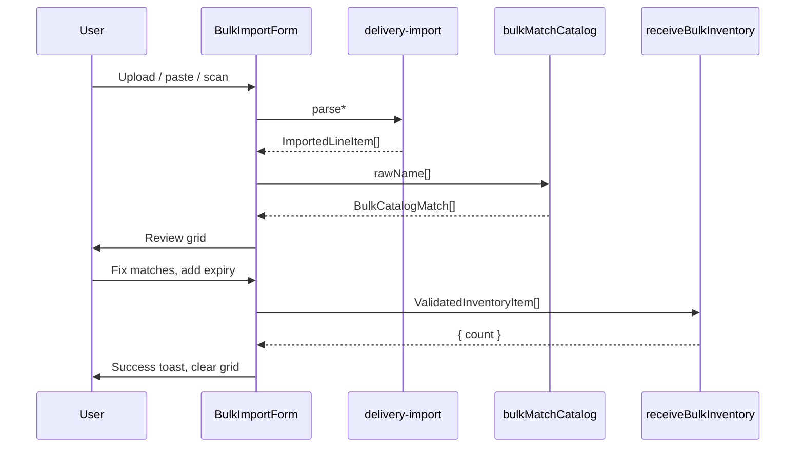

# Bulk Delivery Import — Implementation Reference

This document describes the full implementation of the **CSV / Excel / printed list import** feature on the Receive page. It is intended for code review and design discussions.

---

## Table of contents

1. [Goals and design principles](#1-goals-and-design-principles)
2. [High-level architecture](#2-high-level-architecture)
3. [File map](#3-file-map)
4. [End-to-end data flow](#4-end-to-end-data-flow)
5. [Domain types](#5-domain-types)
6. [Parsing layer (`delivery-import.ts`)](#6-parsing-layer-delivery-importts)
7. [UI layer (`bulk-import-form.tsx`)](#7-ui-layer-bulk-import-formtsx)
8. [KEML matching (`bulkMatchCatalog`)](#8-keml-matching-bulkmatchcatalog)
9. [Stock receive (`receiveBulkInventory`)](#9-stock-receive-receivebulkinventory)
10. [Validation and limits](#10-validation-and-limits)
11. [Supported input formats](#11-supported-input-formats)
12. [Review grid and submit rules](#12-review-grid-and-submit-rules)
13. [Dependencies](#13-dependencies)
14. [Tests](#14-tests)
15. [Known limitations and future work](#15-known-limitations-and-future-work)

---

## 1. Goals and design principles

**Problem:** Pharmacy staff receive stock from suppliers using many different list formats — supplier Excel exports, emailed CSVs, handwritten/printed delivery notes, or simple text like `paracetamol 200 tabs`.

**Objective:** Reduce time spent re-keying inventory, not add reformatting work.

**Design choices:**

| Principle | Implementation |
|-----------|----------------|
| No fixed template required | Fuzzy header matching + column inference + free-text line parsing |
| Minimal client lists OK | Name + quantity only; batch/expiry filled at review |
| Human in the loop | Every line goes through a review grid before DB write |
| KEML safety | Auto-match with confidence badges; manual override via catalog search |
| Tenant isolation | All server actions use `requireTenantContext("receive.stock")` |
| Bounded batch size | Max **100 lines** per import (client parse + server validation) |

---

## 2. High-level architecture

```mermaid
flowchart TB
  subgraph intake [Intake modes]
    F[CSV / Excel file]
    P[Paste text]
    S[Photo scan OCR]
  end

  subgraph parse [Client parsing]
    DI[delivery-import.ts]
    F --> DI
    P --> DI
    S --> DI
  end

  subgraph review [Review UI]
    BF[BulkImportForm]
    DI -->|ImportedLineItem[]| BF
    BF -->|rawName[]| MC[bulkMatchCatalog]
    MC -->|BulkCatalogMatch[]| BF
    BF -->|ValidatedInventoryItem[]| RI[receiveBulkInventory]
  end

  subgraph db [Database]
    RI --> SB[(stockBatch)]
    MC --> KEML[(medicine + aliases)]
  end
```

**Three intake modes** converge on one parser module, then one review grid, then two server actions (match → receive).

---

## 3. File map

| File | Role |
|------|------|
| `src/app/receive/page.tsx` | Route shell; renders `ReceiveWorkspace` |
| `src/components/receive/receive-workspace.tsx` | Tabs: **Manual receive** vs **Import delivery list** |
| `src/components/receive/bulk-import-form.tsx` | Import UI: file upload, paste, scan, review grid, submit |
| `src/lib/receive/delivery-import.ts` | All parsing logic (CSV, Excel, paste, OCR text, templates) |
| `src/lib/receive/delivery-import.test.ts` | Unit tests for parsers |
| `src/lib/types.ts` | `ImportedLineItem`, `BulkCatalogMatch`, `MatchConfidence`, etc. |
| `src/lib/actions/catalog.ts` | `bulkMatchCatalog()` — in-memory KEML scoring |
| `src/lib/actions/inventory.ts` | `receiveBulkInventory()` — transactional batch creation |
| `src/lib/validation.ts` | `bulkReceiveInventorySchema` (Zod) |

---

## 4. End-to-end data flow

```
User input
    │
    ▼
parseCsvText / parseExcelArrayBuffer / parsePastedDeliveryText / parsePrintedLineItems
    │
    ▼
ImportedLineItem[]          ← rawName, quantity, optional batch/expiry/costs
    │
    ▼
bulkMatchCatalog(rawNames[]) ← server: score each name vs full KEML catalog
    │
    ▼
ReviewRow[] in React state   ← editable grid; user fixes matches + expiry
    │
    ▼
ValidatedInventoryItem[]     ← client-side validation before submit
    │
    ▼
receiveBulkInventory(items)  ← server: Zod + Prisma $transaction
    │
    ▼
stockBatch rows created (one per line)
```

**Key handoff:** Parsing produces `ImportedLineItem`. Matching produces `BulkCatalogMatch`. The UI merges them into `ReviewRow`. Submit builds `ValidatedInventoryItem[]` (same shape as single manual receive).

---

## 5. Domain types

Defined in `src/lib/types.ts`:

```typescript
export type MatchConfidence = "HIGH" | "LOW" | "NONE";

/** One parsed row before user review */
export type ImportedLineItem = {
  rawName: string;
  quantity: number;
  batchNumber?: string;
  expiryDate?: string;
  supplierCost?: number;
  retailPrice?: number;
  matchedMedicineId: string | null;   // always null at parse time
  matchConfidence: MatchConfidence;   // always "NONE" at parse time
};

export type BulkCatalogMatch = {
  rawName: string;
  medicineId: string | null;
  matchConfidence: MatchConfidence;
  medicine: CatalogMedicine | null;
};

export type ValidatedInventoryItem = ReceiveInventoryInput; // reuses manual receive shape

export type BulkReceiveResult = { count: number };
```

Parser output always sets `matchedMedicineId: null` and `matchConfidence: "NONE"`. Matching happens in a separate server call after parse.

---

## 6. Parsing layer (`delivery-import.ts`)

All import parsing lives in a single module. External dependencies: **Papa Parse** (CSV), **SheetJS/xlsx** (Excel), **Tesseract.js** (OCR, lazy-loaded).

### 6.1 Public API

| Export | Purpose |
|--------|---------|
| `parseCsvText(text)` | CSV string → `ImportedLineItem[]` |
| `parseExcelArrayBuffer(buffer)` | `.xlsx`/`.xls` → items |
| `parsePastedDeliveryText(text)` | Paste box: try CSV first, else line parser |
| `parsePrintedLineItems(text)` | Free-form / OCR text, one line per item |
| `parseSpreadsheetMatrix(matrix)` | Core grid parser (used internally) |
| `rowsToImportedLineItems(rows)` | Legacy header-keyed objects → matrix → parse |
| `parseExpiry(value)` | Date normalisation helper |
| `scanPrintedListImage(file)` | Client-side OCR → raw text |
| `CSV_TEMPLATE` / `buildExcelTemplateBlob()` | Optional example downloads (not required) |

### 6.2 Parser pipeline (CSV and Excel)

Both CSV and Excel normalise to a **2D string matrix**, then share `parseSpreadsheetMatrix`:

```typescript
// CSV: Papa Parse, no header mode
function matrixFromCsvText(text: string): string[][] {
  const results = Papa.parse<string[]>(text, {
    header: false,
    skipEmptyLines: true,
  });
  // ...
}

export function parseCsvText(text: string): ImportedLineItem[] {
  const matrix = matrixFromCsvText(text);
  const items = parseSpreadsheetMatrix(matrix);
  if (items.length > 0) return items;
  return parsePrintedLineItems(text);  // fallback if grid parse yields nothing
}
```

```typescript
// Excel: first worksheet only, row arrays
export function parseExcelArrayBuffer(data: ArrayBuffer): ImportedLineItem[] {
  const workbook = XLSX.read(data, { type: "array", cellDates: true });
  const sheet = workbook.Sheets[workbook.SheetNames[0]];
  const matrix = XLSX.utils
    .sheet_to_json(sheet, { header: 1, defval: "" })
    .map((row) => row.map((cell) => cellToString(cell)));

  const items = parseSpreadsheetMatrix(matrix);
  if (items.length > 0) return items;

  // flatten rows to lines and run line parser
  const lines = matrix.map((row) => row.filter(Boolean).join(" ")).join("\n");
  return parsePrintedLineItems(lines);
}
```

### 6.3 Core grid parser: `parseSpreadsheetMatrix`

```typescript
export function parseSpreadsheetMatrix(matrix: string[][]): ImportedLineItem[] {
  const nonEmptyRows = matrix
    .map((row) => row.map((cell) => cell.trim()))
    .filter((row) => row.some((cell) => cell.length > 0));

  let dataRows = nonEmptyRows;
  let columnMap: ColumnMap = {};

  // Step 1: detect header row
  if (looksLikeHeaderRow(nonEmptyRows[0])) {
    columnMap = mapHeadersToColumns(nonEmptyRows[0]);
    dataRows = nonEmptyRows.slice(1);
  }

  // Step 2: merge header map with data-inferred columns
  columnMap = mergeColumnMaps(columnMap, inferColumnMapFromData(dataRows));

  // Step 3: map each row
  for (const row of dataRows) {
    const item = matrixRowToItem(row, columnMap);
    if (item) items.push(item);
  }
  return items;
}
```

**Column roles:** `name | quantity | batch | expiry | cost | retail`

#### Header detection (`looksLikeHeaderRow`)

Skips rows that are mostly numeric. Treats a row as a header if any cell scores ≥10 against header patterns (e.g. "Item Description" → name, "Qty Issued" → quantity).

Header patterns include supplier-friendly synonyms:

```typescript
const HEADER_PATTERNS: Record<ColumnRole, RegExp[]> = {
  name: [/medicine/, /drug/, /product/, /item/, /description/, /dawa/, ...],
  quantity: [/qty/, /quant/, /units/, /issued/, /received/, /delivered/, ...],
  batch: [/batch/, /lot/, /serial/],
  expiry: [/expir/, /\bexp\b/, /best before/, /\bbb\b/],
  cost: [/cost/, /purchase/, /supplier/, ...],
  retail: [/retail/, /sell/, /selling/, ...],
};
```

#### Column inference (`inferColumnMapFromData`)

When headers are missing or incomplete, scans column statistics:

- **Name column:** most text-like cells, fewest pure numbers
- **Quantity column:** most numeric-only cells (excluding name column)
- **Expiry column:** ≥40% of cells parse as dates
- **Batch column:** ≥40% batch-like tokens (`LOT-9`, `B-4421`)

#### Row mapping (`matrixRowToItem`)

1. Read cells via column map
2. **Fallbacks** if name/qty missing:
   - Trailing cell is a number → preceding cells joined as name
   - Two columns: `qty, name` or `name, qty`
3. **Last resort:** join row cells into one string → `parsePrintedLineItems`

### 6.4 Free-text line parser

Used for paste, OCR output, and spreadsheet row fallback.

**Entry:** `parsePrintedLineItems` splits on newlines, skips header-like lines (`Medicine`, `Qty`, `#`, etc.), delegates each line to `parseSingleDeliveryLine`.

**Resolution order in `parseSingleDeliveryLine`:**

1. **Comma-separated items on one line**  
   `paracetamol 200 tabs, tramadol 30 vials` → recursive split

2. **Name + quantity + unit** (common client format)  
   Pattern: `{name} {qty} {tabs|vials|caps|...}`

   ```typescript
   const NAME_QTY_UNIT =
     /^(.+?)\s+(\d{1,6})\s+(?:tabs?|tablets?|vials?|caps?(?:ules?)?|...)\s*$/i;

   // "paracetamol 200 tabs"  → name: paracetamol, qty: 200
   // "Metformin 500mg 24 caps" → name: Metformin 500mg, qty: 24
   ```

3. **Tab/comma/semicolon/double-space columns**  
   - Trailing column is qty: `Paracetamol 500mg tabs, 100`
   - Second column is qty: `Paracetamol, 100`
   - First column is qty: `100, Paracetamol`

4. **Trailing quantity on line**  
   `Paracetamol 500mg tabs 100` → qty at end

5. **Leading quantity**  
   `100 x Paracetamol` or `50 Metformin`

**Examples handled:**

| Input | Parsed name | Parsed qty |
|-------|-------------|------------|
| `paracetamol 200 tabs` | paracetamol | 200 |
| `tramadol 30 vials` | tramadol | 30 |
| `Paracetamol 500mg,100` | Paracetamol 500mg | 100 |
| `Paracetamol 500mg Tablet` + `100` (2 cols) | Paracetamol 500mg Tablet | 100 |
| `100 x Paracetamol` | Paracetamol | 100 |

**Not parsed as quantity:** strength-only tokens like `Paracetamol 500mg` (no trailing qty/unit) — these need a separate quantity column or user edit at review.

### 6.5 OCR path

```typescript
export async function scanPrintedListImage(file: File): Promise<string> {
  const { createWorker } = await import("tesseract.js");  // lazy load
  const worker = await createWorker("eng");
  try {
    const result = await worker.recognize(file);
    return result.data.text;
  } finally {
    await worker.terminate();
  }
}
```

Flow in UI:

1. User uploads/takes photo
2. Tesseract extracts text → shown in editable textarea
3. `parsePrintedLineItems(text)` → same pipeline as paste
4. User can edit OCR output and re-parse before matching

OCR runs **entirely client-side** (no server upload of images).

### 6.6 Building a line item

```typescript
function buildLineItem(
  rawName: string,
  quantity: number,
  extras?: { batchNumber?, expiryDate?, supplierCost?, retailPrice? },
): ImportedLineItem {
  return {
    rawName,
    quantity,
    batchNumber: extras?.batchNumber,
    expiryDate: extras?.expiryDate,
    supplierCost: extras?.supplierCost,
    retailPrice: extras?.retailPrice,
    matchedMedicineId: null,
    matchConfidence: "NONE",
  };
}
```

`parseExpiry` accepts `YYYY-MM-DD`, `DD/MM/YYYY`, and falls back to `Date` parsing.

---

## 7. UI layer (`bulk-import-form.tsx`)

### 7.1 Workspace entry

`ReceiveWorkspace` toggles between manual single-item form and bulk import:

```typescript
// receive-workspace.tsx
{mode === "manual" ? <ReceiveIntakeForm /> : <BulkImportForm />}
```

### 7.2 Intake modes

| Mode | State key | Handler |
|------|-----------|---------|
| `file` | drag/drop + hidden input | `handleSpreadsheetFile` → `parseCsvText` or `parseExcelArrayBuffer` |
| `paste` | `pasteText` textarea | `parsePastedDeliveryText(pasteText)` |
| `scan` | image input + `scanPreview` | `scanPrintedListImage` → `parsePrintedLineItems` |

### 7.3 Central load function

Every intake path calls `loadImportedItems`:

```typescript
const loadImportedItems = useCallback((imported: ImportedLineItem[]) => {
  if (imported.length === 0) {
    toast.error("No valid lines found — check medicine names and quantities");
    return;
  }

  startMatch(async () => {
    const response = await bulkMatchCatalog(
      imported.map((item) => item.rawName),
    );
    if (!response.success) {
      toast.error(response.error);
      return;
    }

    setRows(importedToReviewRows(imported, response.data));
    toast.success(`Imported ${imported.length} line(s) — review matches before receiving`);
  });
}, []);
```

`importedToReviewRows` merges parse output with match results:

- Pre-fills quantity, batch, expiry, costs from import
- Sets `selectedMedicine` from `match.medicine` when confidence is HIGH or LOW
- Suggests `stockUnit` from dosage form via `suggestStockUnitFromDosageForm`

### 7.4 Review grid columns

| Column | Editable | Notes |
|--------|----------|-------|
| Imported name | Read-only | Shows `MatchConfidence` badge |
| KEML match | Search override | `MedicineCatalogSearch` per row |
| Qty | Yes | |
| Batch | Yes | Optional |
| Expiry | Yes | **Required before submit** |
| Cost / Retail | Yes | Optional |
| Unit | Yes | `StockUnitSelect` |
| Remove | Trash button | |

### 7.5 Submit

Client validates each row, builds `ValidatedInventoryItem[]`, calls `receiveBulkInventory`. Shared optional supplier name applied to all lines.

```typescript
payload.push({
  medicineId: row.selectedMedicine.id,
  batchNumber: row.batchNumber.trim() || undefined,
  supplierName: sharedSupplier,
  quantityOnHand: qty,
  expiryDate: row.expiryDate,
  stockUnit: row.stockUnit,
  supplierCost,
  retailSalePrice,
});
```

On success: clears grid, supplier, paste text, and scan preview.

### 7.6 Example templates

Optional download buttons generate:

- `CSV_TEMPLATE` — inline string constant
- `buildExcelTemplateBlob()` — in-memory xlsx via SheetJS

These are **examples only**; the parser does not require this layout.

---

## 8. KEML matching (`bulkMatchCatalog`)

**File:** `src/lib/actions/catalog.ts`  
**Permission:** `receive.stock`

### Algorithm

1. Reject empty or >100 names
2. Load full non-stub `medicine` catalog once (with aliases)
3. For each `rawName`, score against every medicine; keep best

```typescript
function scoreCatalogMatch(rawName: string, medicine: MedicineWithAliases): number {
  const q = rawName.trim().toLowerCase();
  const normalized = normalizeQuery(rawName);

  if (generic === q) return 100;
  if (alias exact match) return 100;
  if (searchKey === normalized) return 100;

  if (searchKey.startsWith(normalized)) return 70;
  if (generic.startsWith(q)) return 65;

  if (searchKey.includes(normalized)) return 40;
  if (generic.includes(q)) return 35;
  if (alias includes q) return 35;

  if (all query tokens in searchKey) return 30;
  return 0;
}

function confidenceFromScore(score: number): MatchConfidence {
  if (score >= 100) return "HIGH";
  if (score >= 30) return "LOW";
  return "NONE";
}
```

### Match result usage in UI

| Badge | Meaning | Default UI behaviour |
|-------|---------|----------------------|
| `HIGH` | Score ≥ 100 | Medicine pre-selected |
| `LOW` | Score 30–99 | Medicine pre-selected; user should verify |
| `NONE` | Score < 30 | No selection; user must search |

Manual catalog search always sets confidence to `HIGH` on select.

**Performance note:** O(names × catalog size) in memory. Acceptable for ≤100 names; catalog loaded once per request.

---

## 9. Stock receive (`receiveBulkInventory`)

**File:** `src/lib/actions/inventory.ts`  
**Permission:** `receive.stock`

```typescript
export async function receiveBulkInventory(
  items: ValidatedInventoryItem[],
): Promise<ActionResult<BulkReceiveResult>> {
  const validated = parseInput(bulkReceiveInventorySchema, items);

  // Verify all medicineIds exist and are not stubs
  const medicineIds = [...new Set(validated.map((i) => i.medicineId))];
  // ...

  await db.$transaction(async (tx) => {
    for (const data of validated) {
      await tx.stockBatch.create({
        data: {
          medicineId: data.medicineId,
          batchNumber: data.batchNumber?.trim() || null,
          supplierName: data.supplierName?.trim() || null,
          quantityOnHand: data.quantityOnHand,
          quantityReceived: data.quantityOnHand,
          expiryDate: new Date(data.expiryDate),
          stockUnit: data.stockUnit,
          supplierCost: ...,
          retailSalePrice: ...,
        },
      });
    }
  });

  return { count: validated.length };
}
```

**Transactional:** All batches succeed or none are created. Same `stockBatch.create` shape as single manual receive.

---

## 10. Validation and limits

### Server (Zod)

```typescript
export const bulkReceiveInventorySchema = z
  .array(receiveInventorySchema)
  .min(1, "At least one line is required")
  .max(100, "Maximum 100 lines per bulk import");
```

Per-line `receiveInventorySchema` requires:

- `medicineId` (valid id)
- `quantityOnHand` (positive int, max 1_000_000)
- `expiryDate` (parseable date string)
- `stockUnit` (enum)
- Optional: batch, supplier, costs, unitsPerPack

### Client (before server call)

- Every row must have `selectedMedicine`
- Quantity must be positive integer
- **Expiry required** on every row (even if import had none)
- Costs must be non-negative if provided

### Parser / match limits

- No hard line cap in parser (UI could import large paste); server rejects >100 on match and receive
- OCR quality depends on print clarity; handwritten lists not supported

---

## 11. Supported input formats

### Spreadsheet (CSV / Excel)

- Any column headers (supplier-specific names OK)
- No headers (two-column name + qty inferred)
- Single column with embedded text: `paracetamol 200 tabs`
- Extra columns: batch, expiry, cost, retail when detectable
- First worksheet only for Excel

### Paste

- CSV-shaped paste (tabs/commas)
- One item per line
- Comma-separated items on one line
- Mix of formats in one paste block

### Photo scan

- JPG/PNG/WebP
- Printed text only (UI warns about handwriting)
- Editable OCR output before parse

### Explicitly not required

- AfyaSmart template columns
- Specific date format (multiple accepted)
- Batch or expiry on import (added at review)

---

## 12. Review grid and submit rules



**Business rules enforced at review:**

1. Cannot submit without KEML match on every line
2. Cannot submit without expiry on every line
3. Supplier name is optional and shared across lines
4. User can remove individual rows or clear entire grid

---

## 13. Dependencies

| Package | Version | Use |
|---------|---------|-----|
| `papaparse` | ^5.5.3 | CSV → matrix |
| `xlsx` | ^0.18.5 | Excel read + example template write |
| `tesseract.js` | ^7.0.0 | Client OCR (dynamic import) |
| `@types/papaparse` | ^5.5.2 | Types |

All parsing except OCR is synchronous. Tesseract is code-split so it only loads when scan mode is used.

---

## 14. Tests

**File:** `src/lib/receive/delivery-import.test.ts`  
**Runner:** Vitest

Coverage areas:

| Test suite | What it verifies |
|------------|------------------|
| `parsePrintedLineItems` | Trailing qty, leading qty, name+qty+unit, comma-separated |
| `parseSpreadsheetMatrix` | No-header inference, supplier headers, messy single cell, embedded unit |
| `parseCsvText` | Non-template CSV headers |
| `parsePastedDeliveryText` | CSV-shaped paste |
| `parseExcelArrayBuffer` | Real xlsx buffer round-trip |
| `rowsToImportedLineItems` | Flexible column names |

Run:

```bash
npm test -- --run src/lib/receive/delivery-import.test.ts
```

Server actions (`bulkMatchCatalog`, `receiveBulkInventory`) are not unit-tested in this file; they follow existing action patterns with integration/e2e coverage elsewhere.

---

## 15. Known limitations and future work

| Limitation | Notes |
|------------|-------|
| Max 100 lines | Hard cap on match + receive; larger lists need splitting |
| First Excel sheet only | Multi-sheet workbooks ignore sheets 2+ |
| OCR accuracy | Printed text only; no server-side vision model |
| Ambiguous strength vs qty | `Paracetamol 500` without unit may mis-parse; user corrects in grid |
| No column mapping UI | Auto-detect fails → user can paste as lines or manual edit grid |
| No duplicate-line merge | Same medicine twice → two review rows → two batches |
| Match is in-memory scan | Fine at 100 lines; may need indexing if catalog grows huge |

**Possible Phase 2 enhancements:**

- Manual column mapper when auto-detect confidence is low
- Handwriting / invoice PDF via server vision API
- Preview of "unparsed lines" before match
- Merge duplicate medicines in review grid

---

## Quick reference: call chain by intake mode

### CSV file

```
file.text()
  → parseCsvText()
    → matrixFromCsvText() + parseSpreadsheetMatrix()
    → [fallback] parsePrintedLineItems()
  → bulkMatchCatalog()
  → review grid
  → receiveBulkInventory()
```

### Excel file

```
file.arrayBuffer()
  → parseExcelArrayBuffer()
    → XLSX.read + parseSpreadsheetMatrix()
    → [fallback] parsePrintedLineItems()
  → bulkMatchCatalog()
  → ...
```

### Paste

```
parsePastedDeliveryText()
  → try parseCsvText()
  → else parsePrintedLineItems()
  → bulkMatchCatalog()
  → ...
```

### Photo

```
scanPrintedListImage()        // Tesseract
  → parsePrintedLineItems()
  → bulkMatchCatalog()
  → ...
```

---

*Last updated: reflects flexible parsing including name+quantity+unit lines (`paracetamol 200 tabs`) and format-agnostic spreadsheet import.*
