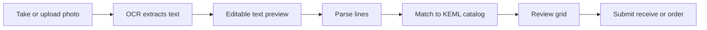

# AfyaStock — Photo OCR import (printed lists)

How AfyaStock turns a **photo of a printed supplier or delivery list** into reviewable stock or procurement lines.

> **Printed only today.** Handwritten notes are **not supported** — Tesseract.js accuracy on handwriting is too poor for pharmacy use. Staff should use CSV/Excel, paste, or type for handwritten lists.

---

## Where it works

| Screen | Path | What you import |
|--------|------|-----------------|
| **Receive stock** | `/receive` → Bulk import → **Scan photo** | Delivery lines (medicine + qty → batches) |
| **Procurement** | `/procurement` → Import partner list → **Scan photo** | Reorder lines (medicine + qty → draft order) |

Both screens share the same OCR and line-parsing code.

---

## User flow (staff)



1. Open **Receive** or **Procurement** and switch to bulk import.
2. Choose **Scan photo**.
3. Take a picture with the phone camera (`capture="environment"`) or upload JPG / PNG / WebP.
4. Wait while the app reads the page (**client-side only** — the image never leaves the device for OCR).
5. Review **Extracted text** in the textarea; fix obvious OCR mistakes (e.g. `O` → `0`, `l` → `1`).
6. Tap **Re-parse edited text** if you changed the preview.
7. Check the **review table**: each row shows imported name, suggested KEML match, quantity, and (on Receive) batch/expiry/cost fields.
8. Fix any wrong matches with the catalog search per row.
9. Submit — stock is received or lines are added to the procurement draft.

**UI tips shown to staff:** flat page, good lighting, printed text only.

---

## Printed vs handwritten

| Type | Supported? | Notes |
|------|------------|-------|
| **Printed** delivery note, KEMSA order, supplier Excel printout | ✅ Yes | Intended use case |
| **Typed PDF** (screenshot or photo of screen) | ⚠️ Sometimes | Better to copy-paste if text is selectable |
| **Handwritten** lists | ❌ No | UI warns: *"not handwritten — accuracy is poor"* |
| **Invoices / complex layouts** | ⚠️ Variable | Multi-column tables may need manual edit of extracted text |

Handwriting is a known future direction (server vision API) — see [Future work](#future-work).

---

## Technical architecture

### Design principles

- **OCR runs in the browser** — no image upload to Vercel or Neon for scanning.
- **Same pipeline as paste** — OCR output is plain text; `parsePrintedLineItems()` handles OCR and pasted free-form lists identically.
- **Human-in-the-loop** — nothing is committed until staff review matches and quantities.

### Key files

| File | Role |
|------|------|
| [`src/lib/receive/delivery-import.ts`](../src/lib/receive/delivery-import.ts) | OCR (`scanPrintedListImage`), parsers, CSV/Excel helpers |
| [`src/components/receive/bulk-import-form.tsx`](../src/components/receive/bulk-import-form.tsx) | Receive UI — scan tab, preview, review grid |
| [`src/components/procurement/procurement-import-form.tsx`](../src/components/procurement/procurement-import-form.tsx) | Procurement UI — same scan pattern |
| [`src/lib/actions/catalog.ts`](../src/lib/actions/catalog.ts) | `bulkMatchCatalog()` — fuzzy match raw names → KEML |

### Dependency

```json
"tesseract.js": "^7.0.0"
```

Loaded **only when scan mode is used** (dynamic `import()`), so normal pages do not pay the ~2 MB worker cost.

---

## OCR step (`scanPrintedListImage`)

```typescript
export async function scanPrintedListImage(file: File): Promise<string> {
  const { createWorker } = await import("tesseract.js");
  const worker = await createWorker("eng");
  try {
    const result = await worker.recognize(file);
    return result.data.text;
  } finally {
    await worker.terminate();
  }
}
```

| Setting | Value |
|---------|--------|
| Engine | [Tesseract.js](https://tesseract.projectnaptha.com/) v7 |
| Language | `eng` (English — covers most supplier printouts and Latin drug names) |
| Runtime | Web Worker in the browser |
| Input | `File` from `<input type="file" accept="image/jpeg,image/png,image/webp" capture="environment">` |
| Output | Raw multiline string |

---

## Line parsing (`parsePrintedLineItems`)

After OCR, text is split line-by-line with heuristics for common pharmacy list shapes:

| Pattern | Example | Parsed |
|---------|---------|--------|
| Trailing quantity | `Paracetamol 500mg 100` | name + 100 |
| Leading quantity | `100 x Amoxicillin` | Amoxicillin + 100 |
| Tab/comma columns | `Paracetamol 500mg Tablet,100` | name + 100 |
| Two columns | `Paracetamol 500mg Tablet` + `100` | name + 100 |

Header rows (`Medicine`, `Qty`, `#`, etc.) are skipped.

**OCR-specific note:** garbled characters often break parsing. That is why the **editable preview** step exists — staff can fix `Paracetamo1 5OOmg lOO` before re-parse.

Structured CSV/Excel headers (batch, expiry, cost) are **not** inferred from free-form OCR lines; those fields are filled in the review grid on Receive, or omitted on Procurement.

Full parser details: [`docs/bulk-delivery-import.md`](./bulk-delivery-import.md) §6.

---

## Catalog matching

Parsed names are sent to the server action `bulkMatchCatalog(rawNames[])`:

1. Normalises each raw string.
2. Searches shared KEML + alias catalog (brand names, KEMSA labels, user-learned aliases).
3. Returns confidence: `HIGH`, `LOW`, or `NONE` per line.
4. UI pre-selects matches for HIGH/LOW; staff must confirm or override.

OCR typos that survive editing may still match via fuzzy alias logic; completely wrong tokens show as **NONE** and need manual catalog pick.

---

## UI handler (Receive — same in Procurement)

```typescript
const handleScanFile = (file: File) => {
  if (!file.type.startsWith("image/")) {
    toast.error("Upload a photo of the printed list (JPG or PNG)");
    return;
  }

  startScan(async () => {
    const text = await scanPrintedListImage(file);
    setScanPreview(text);
    const imported = parsePrintedLineItems(text);
    if (imported.length === 0) {
      toast.error("Could not detect any lines — edit the extracted text below or paste manually");
      return;
    }
    loadImportedItems(imported); // → bulkMatchCatalog → review rows
  });
};
```

`handleScanPreviewSubmit` re-runs `parsePrintedLineItems(scanPreview)` after manual edits.

---

## Privacy and offline

| Concern | Behaviour |
|---------|-----------|
| Photo storage | Not persisted — held in memory for OCR only |
| Server upload | Image is **not** sent to the API for scanning |
| Network | Required after parse for `bulkMatchCatalog` and submit (unless catalog was cached for offline — match still needs online today) |
| PWA / mobile | Camera capture works on installable PWA; first scan downloads Tesseract language data |

---

## Tips for best results

1. **Print, don’t scribble** — use supplier printouts or typed lists.
2. **Flat and well lit** — avoid shadows and curved pages.
3. **Fill the frame** — one list per photo; crop mentally to the table.
4. **Edit the preview** — fix obvious OCR errors before re-parse.
5. **Fallback paths** — CSV/Excel from supplier, or paste from email/WhatsApp, often beat a bad photo.

---

## Limitations

| Limitation | Impact |
|------------|--------|
| English OCR only | Swahili-only handwritten labels on packaging may misread |
| No handwriting model | Cursive / ballpoint lists unusable |
| No PDF OCR in-app | Export PDF to image or copy text and paste |
| No batch/expiry from OCR lines | Staff enter on Receive review grid |
| Client CPU | First scan can take several seconds on low-end phones |
| Table structure | Merged cells / multi-page invoices may need manual text edit |

---

## Future work

Documented in [`docs/bulk-delivery-import.md`](./bulk-delivery-import.md):

- Server-side vision API for handwriting and invoice PDFs
- Swahili + English OCR language pack
- Barcode scanning on camera (separate feature)

---

## Related docs

- [`docs/bulk-delivery-import.md`](./bulk-delivery-import.md) — full import pipeline (CSV, Excel, paste, OCR, templates)
- [`docs/catalog-ingestion.md`](./catalog-ingestion.md) — how supplier names map to KEML
